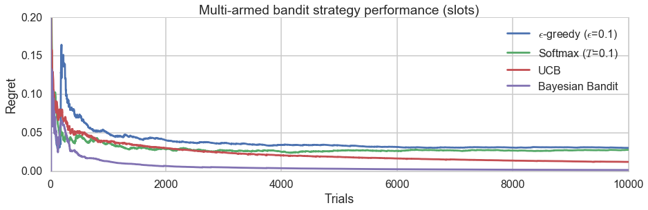

# slots
### *A multi-armed bandit library for Python*

Slots is intended to be a basic, very easy-to-use multi-armed bandit library for Python.

#### Author
[Roy Keyes](https://roycoding.github.io) -- roy.coding@gmail

#### License: BSD
See [LICENSE.txt](https://github.com/roycoding/slots/blob/master/LICENSE.txt)


### Introduction
slots is a Python library designed to allow the user to explore and use simple multi-armed bandit (MAB) strategies. The basic concept behind the multi-armed bandit problem is that you are faced with *n* choices (e.g. slot machines, medicines, or UI/UX designs), each of which results in a "win" with some unknown probability. Multi-armed bandit strategies are designed to let you quickly determine which choice will yield the highest result over time, while reducing the number of tests (or arm pulls) needed to make this determination. Typically, MAB strategies attempt to strike a balance between "exploration", testing different arms in order to find the best, and "exploitation", using the best known choice. There are many variation of this problem, see [here](https://en.wikipedia.org/wiki/Multi-armed_bandit) for more background.

slots provides a hopefully simple API to allow you to explore, test, and use these strategies. Basic usage looks like this:

```Python
import slots

# Try 3 bandits with arbitrary win probabilities
b = slots.MAB()
b.run()
```

To inspect the results and compare the estimated win probabilities versus the true win probabilities:
```Python
b.best()
> 0

# Assuming payout of 1.0 for all "wins"
b.est_payouts()
> array([ 0.83888149,  0.78534031,  0.32786885])

b.bandits.probs
> [0.8020877268854065, 0.7185844454955193, 0.16348877912363646]
```

For "real world" (online) usage, test results can be sequentially fed into an `MAB` object. The tests will continue until a stopping criterion is met.

Using slots to determine the best of 3 variations on a live website.
```Python
mab = slots.MAB(live=True, payouts=[]*3)
```

Make the first choice randomly, record responses, and input reward 2 was chosen. Run online trial (input most recent result) until test criteria is met.
```Python
mab.online_trial(bandit=2,payout=1)
```

The response of mab.online_trial() is a dict of the form:
```Python
{'new_trial': boolean, 'choice': int, 'best': int}
```
Where:
- If the criterion is met, `new_trial` = `False`.
- `choice` is the current choice of arm to try.
- `best` is the current best estimate of the highest payout arm.

By default, slots uses the epsilon greedy strategy. Besides epsilon greedy, the softmax and upper credibility bound strategies are also implemented.

#### Regret analysis
A common metric used to evaluate the relative success of a MAB strategy is "regret". This reflects that fraction of payouts (wins) that have been lost by using the sequence of pulls versus the currently best known arm. The current regret value can be calculated by calling the `mab.regret()` method.

For example, the regret curves for several different MAB strategies can be generated as follows:
```Python

import matplotlib.pyplot as plt
import seaborn as sns
import slots

# Test multiple strategies for the same bandit probabilities
probs = [0.4, 0.9, 0.8]

ba = slots.MAB(probs=probs)
bb = slots.MAB(probs=probs)
bc = slots.MAB(probs=probs)
bd = slots.MAB(probs=probs)

# Run trials and calculate the regret after each trial
rega = []
regb = []
regc = []
regd = []
for t in range(10000):
    ba._run('eps_greedy')
    rega.append(ba.regret())
    bb._run('softmax')
    regb.append(bb.regret())
    bc._run('ucb')
    regc.append(bc.regret())
    bd._run('bayesian_bandit')
    regd.append(bd.regret())


# Pretty plotting
sns.set_style('whitegrid')
sns.set_context('poster')

plt.figure(figsize=(15,4))
plt.plot(rega, label='$\epsilon$-greedy ($\epsilon$=0.1)')
plt.plot(regb, label='Softmax ($T$=0.1)')
plt.plot(regc, label='UCB')
plt.plot(regd, label='Bayesian Bandit')
plt.legend()
plt.xlabel('Trials')
plt.ylabel('Regret')
plt.title('Multi-armed bandit strategy performance (slots)')
plt.ylim(0,0.2);
```


### API documentation
For documentation on the slots API, see [slots-docs.md](https://github.com/roycoding/slots/blob/master/docs/slots-docs.md).


### Todo list:
- More MAB strategies
  - Bayesian bandits
- Argument to save regret values after each trial in an array.
- TESTS!
